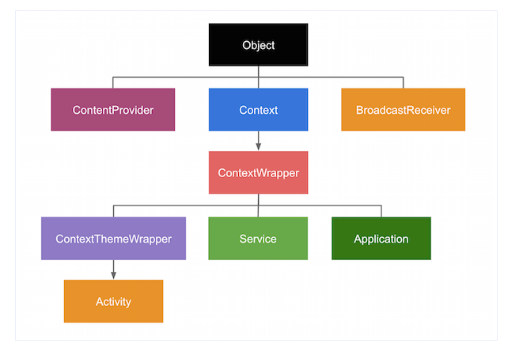
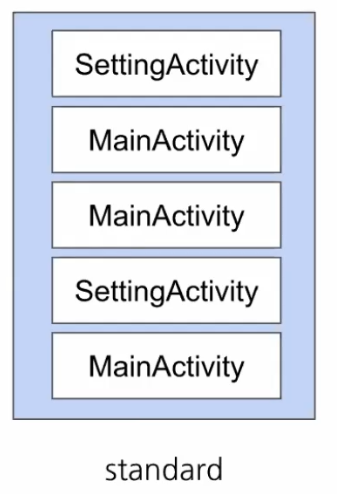
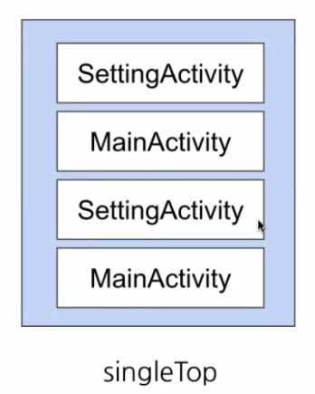
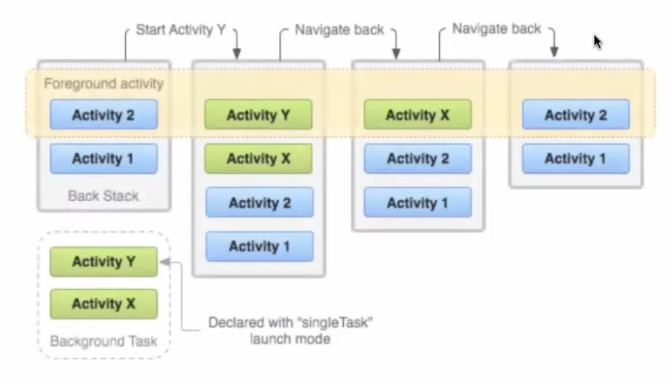
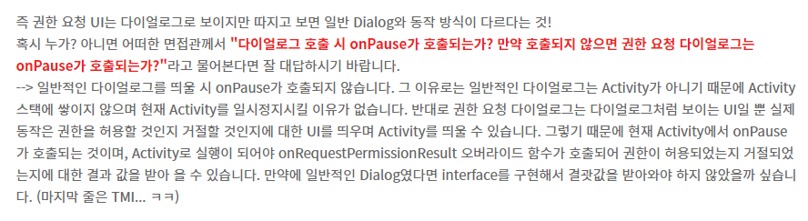

# day4

### **context**

- 화면과 상관없이 애플리케이션 환경에 대한 글로벌 정보를 가지는 인터페이스
- 즉 애플리케이션의 현재상태를 나타내거나 액티비티, 애플리케이션의 정보를 얻기위해 사용한다. 즉 context를 가지고 해당 내용에 맞는 정보를 시스템에서 가져온다 by Activity Manager
- 리소스, 데이터베이스, shared preference에 접근하기 위해 사용된다
- 액티비티, 애플리케이션은 context를상속한다

    

    

### A**pplicationContext**

- 애플리케이션의 lifecycle을 따르는 싱글톤 인스턴스 → 앱 종료될떄까지 동일
- 현재 context가 종료된 이후에도 컨텍스트가 필요한 작업이나 액티비티 스코프를 벗어난 컨텍스트가 필요한 작업에 적합

ex) 애플리케이션 전체에서 사용할 라이브러리를 특정 액티비티에서 초기화할때 ApplicationContext사용

- getApplicationContext()통해 접근가능
- 즉 모든 component에서 사용가능한 context 하지만 Activity Context가 제공하는 기능 전체 제공하는 것은 아님
- 주로 싱글톤객체에는 Application Context전달

Activity Context

- 액티비티의 lifecycle을 따르는 context → onDestroy()와 함께 사라진다
- activity에대한 환경정보들이 있으며 이 context에 intent를 통해 다른 액티비티를 띄우면 액티비티 스택이 쌓이게된다
- 즉 자신의 activity에서만 사용가능한 context
- Toast, Dialog 등 UI operation에서 context가 필요하다면 사용(GUI와 관련한 context. Toast는 예외로 Application Context가능)

    ㄴ application context를 사용한다면 액티비티가 사용되지 않는 이후에도 불필요하게 액티비티를 참조하고 있으므로 메모리 누수 발생

    ㄴ AlertDiaglog만들때 Application Context 사용하면 에러난다

ContentProvider에서 getContext()

- ApplicationContext다

주로 가장 가까운 스코프에 해당하는 context를 직접사용한다.

참조가 해당 컴포넌트의 lifeCycle을 넘어서지 않는다면 메모리 누수 걱정없이 컴포넌트 유지가능.

액티비티나 서비스 이외의 객체에서 context사용하는 경우 Application Context사용

### **baseContext**

ContextWrapper : 해당 클래스의 모든  호출을 다른 context에 위임하는 Context의 Proxy구현체 

ㄴ context 소유한다

 모든 view는 context를 가진다

### **LifeCycleOwner**

activity, fragment와 같은 component의 lifecycle 상태 관련 정보를 포함해, 다른 객체가 이 상태를 관찰할 수 있도록 지원하는 클래스

### **LifeCycleObserver**

actiivity, fragment는 liftcycleOwner구현체

lifecycle 관찰하는 객체 이후 Owner에 알려준다

### **activity와 task**

tast : 사용자와 상호작용하는 activity의 stack

stack에는 하나의 activity가 여러번 인스턴스화 가능

ㄴ task관리로 같은 activity 2번이상 인스턴스화 되지 않도록 처리!

### **task관리**

activity 중단시켜야 하는 경우 → 보안상 종료해야하는 경우 ex) 은행 앱

base activity를 제외한 모든 activity를 제거해야 하는 경우 → 쇼핑앱에서 주문완료하면 이전 주문단계로 안간다

activity실행할 때 새로운 task 내에 배치되도록 처리해야하는경우 → 이후 task 한번에 지우기

activity실행할 떄 기존 activity있다면 새로 인스턴스화 하지않고 기존꺼 맨 위로 올리기

## **AndroidManifest에서 activity launch Mode지정가능**

### **standard**

- task에 activity의 새로운 인스턴스 생성
- activity는 여러번 인스턴스화 될 수 있고, 각각 서로 다른 task에 속할 수 있다

### **singleTop**

- 인스턴스가 이미 task의 맨 위에있으면 새로운거 생성하지않고 기존 인스턴스 사용

### **singleTask**

- 새로운 task생성하고 activity인스턴스화
- 이미 한 task에 activity존재한다면 새롭게 인스턴스화 시키지 않고 기존의 인스턴스 사용
- 즉 activity의 인스턴스는 하나만 존재가능

### **singleInstance**

- 항상 새로운 task실행하며, activity의 인스턴스는 하나만 존재가능

### **데이터 전달**

- intent : 안드로이드 시스템이 어떤 component를 시작할 지 판별하는데 사용할 정보를 가짐
- component이름 : 명시적으로 intent를 만들어 정의한 component에만 메시지 전달
- extra : 작업에 필요한 추가 정보가 담긴 (key, value) 쌍

### **bundle**

- 데이터를 한꺼번에 담을 수 있는 객체(key, 구조체)
- primitive타입이 아닌 경우 직접 Parcelable을  구현해야한다
- 크기 제한 가진다

### **명시적 intent**

- 특정 component로 전달하는 intent
- 메시징 객체, 다른 앱 구성요소로부터 특정한 작업 요청
- startActivity()에 intent넣으면 코드상에 보이지않는 Android System이 intent destination component로 intent전달

### **fragment argument**

- fragment의 캡슐화 (이전 fragment의 정보 최소한으로 전달하므로)
- 최소한의 데이터 전달 → 용량제한이 있다

### **permission**

- 사용자 정보를 보호하기 위해 특정 기능에 대한 접근을 제한

ex) 갤러리에 접근, 카메라기능 ... → 권한 허용했더라도 너무 오랫동안 안쓰면 회수할 수 있다

- AndroidManifest에 추가해준다

permission요청 workflow

- 예전모델 → 앱 설치시 권한 요청
- 요즘모델 → 앱에서 특정 권한 필요할 때 권한요청 + 권한 요청 이유 설명필요
- 사용자는 언제든지 설정으로 권한 해제 가능
- permission은 주로 dialog가 띄워지는데 다른 dialog와 다르게 onPause가 호출된다

    ㄴ focus를 잃었을 때 onPause가 호출되는데, permission은 모양만 dialog형태지 activiity이므로 permission dialog(system dialog)를 띄울 때 onPause를 호출한다

    ㄴ 반면 일반적인 dialog는 activity로 구현하지 않으므로 onPause호출 x

    

    

[https://programmar.tistory.com/46](https://programmar.tistory.com/46)