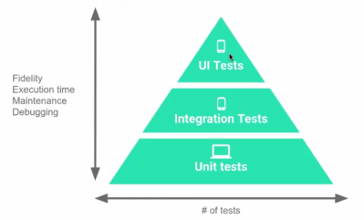

# day5

### **sw테스트 방법 - 화이트박스, 블랙박스 테스트**

### **화이트박스 테스트**

- input → 내가 짠 코드 → 원하는 output나오는지 확인
- 주로 개발자 스스로 하는 작업

### **블랙박스 테스트**

- 내부 구조모르고 input넣고 원하는 output나오는지 확인
- 주로 QA팀이(내부구조 잘 모르는사람) 진행하는 작업

### **xUnit**

- Unit Test Framework 즉 여러 단위 테스트 프레임워크에 대한 통합 이름

### **Right-BICEP : 무엇을 테스트 할 것인가**

- 코드가 정상적으로 동작한다면 어떻게 확인가능?
- 코드에 대해 테스트 할 수 없다면 아직 내용을 이해하지 못하고 있는 것
- 테스트가 가능하려면 class, method가 단일 책임을 가지는것이 좋다.

Right : 결과가 올바른가?

Boundary Exception : 경계 조건은 올바른가?

Inverse RelationShip : 역 관계를 검사할 수 있는가?

ㄴ 결과에서 역으로 입력 구하기

Cross-check : 다른 수단을 활용하여 교차 검사할 수 있는가?

ㄴ 다른테스트 코드로 결과 검증

Error Conditions : 오류 조건을 강제로 일으킬 수 있는가?

ㄴ error handling 가능한지?

Performance Characteristics : 성능 조건은 기준에 부합하는가?

ㄴ 병목현상 원인 찾기

### **테스트 더블**

어떤 하나의 클래스/함수를 테스트하고 싶을 때, 필요한 임시 값, 클래스

ex) DB로부터 조회한 값을 연산하는 함수를 테스트하기위해선 DB의 영향을 받는다. 따라서 실제 DB를 대체해 줄 수 있는 객체가 테스트 더블

5가지 종류 존재

- FAKES : 실제 동작에 가까운 구현체
- STUBS : 미리 정의된 동작을 하는 특별한 FAKE 객체
- MOCKS : 특정 함수의 동작을 확인하기 위해 호출
- DUMMIES : 파라미터를 채우기 위해 동작 없이 값을 전달
- SPIES : 다른 객체와의 인터랙션을 기록하는 역할

**DUMMY**

- 인스턴스화 된 객체가 필요하지만 기능은 필요하지 않는 경우

즉 객체는 전달되지만 사용되지 않거나 객체의 메서드는 정상동작을 보장x

```
public class PrintWarningDummy implements PrintWarning {
    @Override
    public void print() {
        // 아무런 동작을 하지 않는다.
    }
}
```

**FAKE**

- 임시 값을 제공하는 단순화한 객체

즉 동작은 하지만 실제 객체처럼 정교하게 동작하지는 않는 객체

ex) 로그인 기능만 테스트하고 싶을떄 실제 DB에서 유저정보 가져오는 것이 아닌 FAKE객체로부터(주로 map이나, list)에서 임시의 값을 가져와서 테스트

**STUB**

- DUMMY객체가 실제로 동작하는 것 처럼 보이게 만들어 놓은 객체

즉 프로그래밍된 내용에 대해서만 의도된 결과를 제공하는 객체

ex) 항상 Test User라는 이름의 User만 반환

```kotlin
public class StubUserRepository implements UserRepository {
    // ...
    @Override
    public User findById(long id) {
        return new User(id, "Test User");
    }
}
```

**MOCK**

- 호출에 대한 기대를 명세하고 내용에 따라 동작하도록 프로그래밍 된 객체
- 밑에서 추가로..

**SPY**

- STUB의 역할을 가지면서 호출된 내용에 대해 약간의 정보 기록

ex) 자기 자신의 호출횟수 count할 수 있으면 SPY

- 실제 객체처럼 동작시킬 수도 있고, STUB객체로 만들어서 동작 지정할 수 있다

즉 실제 객체로도 사용할 수 있고 STUB객체로도 활용할 수 있으며 필요한 경우 특정 메서드가 제대로 호출되었는지 여부 확인가능

[https://velog.io/@lxxjn0/Test-Double을-알아보자](https://velog.io/@lxxjn0/Test-Double%EC%9D%84-%EC%95%8C%EC%95%84%EB%B3%B4%EC%9E%90)

### **테스트코드 작성요령**

테스트코드를 먼저 작성하고! 구현체를 구현해야한다.

코딩테스트 testcase 만족하는 코드 작성하는것 생각!

테스트코드 작성역량 == 개발자 역량

테스트코드를 잘 작성할수록 서비스 품질 올라간다

### **TDD(Test Driven Develop) 테스트주도 개발**

1. 테스트 통과시키기
2. 리팩터링
3. 실패하는 단위테스트 작성
4. 1~3 반복

### **리팩터링**

sw의 겉보기 동작은 그대로 유지한 채, 코드를 이해하고 수정하기 쉽도록 내부구조 변경하는것!

즉 리팩터링동안은 코드가 항상 정상작동하므로 리팩토링은 테스트코드가 이미 작성되어있어야하는 상태이다.

ex) 리팩터링하다가 코드가 꺠져서 고장났다 = 리팩터링x. 리팩터리 중에는 항상 정상작동하므로

### **Test source sets**

app폴더 내부에 3개의 source set존재 main, test, androidTest

**main**

- app의 모든 코드(production code)가 존재.

    ㄴ 테스트 코드는 app코드에 접근 가능 but app코드는 테스트 코드에 접근x

즉 테스트코드 → app코드의 단방향 참조만 일어난다

- 테스트 코드는 출시되는 앱에 포함되지 않는다

**test 디렉토리**

- local Test를 의미 = local machine(android studio)에서 수행한다는 의미
- 단위테스트(로직만 테스트)
- fast, less fidelity(충실도. 실제 환경과 유사한 정도)

**androidTest 디렉토리**

- Instrumented(계측) Test를 의미 = Real, emulated device에서 수행한다는 의미
- UI테스트도 진행
- slow, more fidelity

### **단위테스트(Unit Test)**

- 각 단위(클래스, 함수)가 올바르게 작동하는지, 다른 단위와 제대로 상호작용하는지 검사하기 위함
- 각 단위기능을 별개로 검사
- 각 단위당 여러개의 단위테스트 진행되어도 된다.
- 통과했으면 해당 기능은 정상동작이 보장된다고 다른사람에게 설득가능!!

JUnit : Android Studio와 잘 통합되어있는 Test framework

위에부터 1 : 2 : 7로 단위테스트 진행




### **통합 테스트(Integration Test)**

- 개별적으로 테스트된 단위들이 올바르게 통합되어 작동하는지 검사
- 연관된 단위들이 함께 작동하는것을 테스트
- android에서는 UI와 상호작용을 검사해야하므로  UI수준에서 앱 테스트할때 작성

주로 화면별로 통합테스트를 작성한다

Espresso : UI Test framework

### **일관된 테스트 코드 작성 : Given / When / Then**

**AAA(Arrange, Act, Asset)**와 유사

Given : 테스트를 하기 위해 필요한 object나 state를 set up한다

When : 테스트 대상에 실제로 발생하는 action or 변경사항 만든다

Then : action이후의 결과 검사(assertion으로 확인한다). test가 pass인지 아닌지 확인가능

assertEquals(result, 0f)

assertThat(result,'is' (0f))  //hamcrest frameworks 적용한 방식. 가독성 높아진다

**AAA패턴(Arrange, Act, Assert)**

Arrange : 준비단계. 객체 생성 or 테스트 전 필요한 API호출

Act : 테스트코드 실행

Assert : 실행한 코드 동작 확인

### **test naming convention**

주로 이렇게 사용한다 

(test하려는 대상)_(발생하는 상호작용)_(결과)

ex) getActive AndCompletedStats_noCompleted_returnzZeroHundred

### **Mock object(모의 객체)**

- integration test에서 주로 사용한다.
- fake와 차이점은 fake은 데이터를 따로 map이라 list로 만들어줘야한다
- 다른 컴포넌트를 테스트와 관계없는 것처럼 만들어서 테스트할 범위에만 집중
- 테스트 이외의 객체들을(경계에 있는 객체들을) 모의 객체로 만든다

**Mock object in Unit Test**

- 클래스 단위로 테스트
- 테스트하려는 클래스가 다른 클래스에 대해 의존성 가질 수 있다

    ㄴ 모의 객체로 만든다

- 모의 객체가 어떻게 작동하는지는 중요 x → Mockito같은 framework로 간단히 모의 객체 생성해서 사용한다

**Mock object in Integration Test**

- 모의 객체를 기능별로 격리하기 위해 사용 x
- 앱이 상호작용하는 외부의 것과 격리하기 위해 사용 ex) 외부 library

### **Test Scope과 방법 결정**

**Unit Test**

- 단일 함수, 클래스가 대상
- 빠르게 확인할 수 있는 작은 범위의 테스트

**Integration Test**

- 여러 클래스가 대상
- 기능 테스트, 기기 테스트

**End to End Test**

- 가장 큰 범주의 테스트
- 앱의 전체 동작 테스트 + 기기 테스트

**테스트 코드가 작성되어있지 않다면**

- **utility class**같이 쉽게 테스트 가능한 부분을 찾는다.
- 새로운 피쳐에 적용(TDD는 test first이지만 피치못할 경우이므로 test last라도 진행하자)
- 버그가 생기지 않도록 테스트코드 먼저 작성하고 나서 리팩터링 진행

### **utility class**

여러 클래스에서 공통적으로 사용되는 메서드를 효율적으로 관리하기위한 클래스

### **ViewModel**

- 앱의 UI data를 저장하고, 관리할 수 있게 설게된 추상클래스
- configuration이 변경되어도 data유지한다 ( lifeCycle이 엄청 길다)

    ㄴ configuration : 화면 가로로 전환 ...

- onSaveInstanceState와 다르게 size제한이 없다
- 메모리에 data를 저장하므로 dist/네트워크 data보다 읽는 속도 빠르다

### **ViewModel 나온 이유**

User interface와 관련된 task, UI에 필요한 데이터의 관심사의 분리를 위해

- 주로 LiveData를 사용하여 UI 업데이트

### **LiveData**

data.observe()하면 변경된 데이터로 UI 반영된다