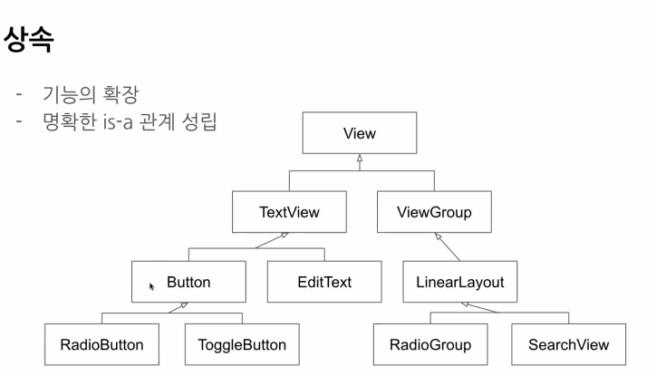
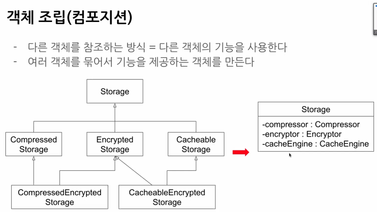
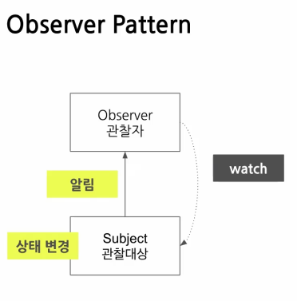
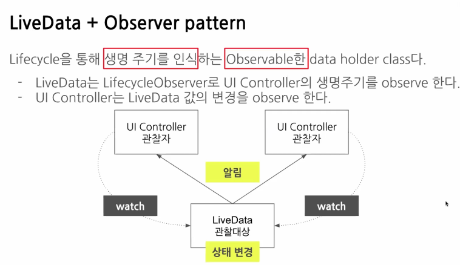
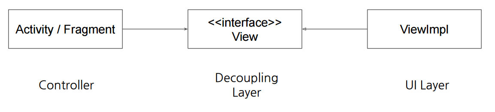
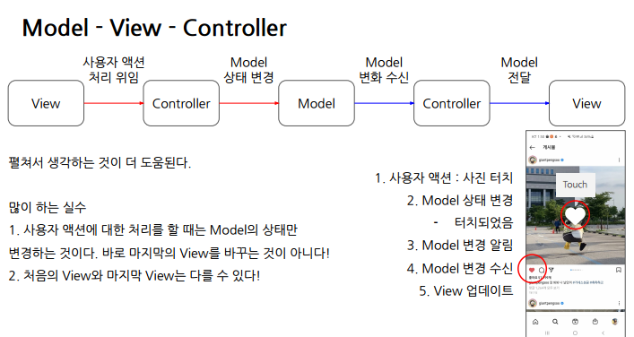

# day8

### **SW 아키텍쳐**

- 시스템을 만드는 중요한 설게결정. 결정의 중요도는 변경에 드는 비용으로 측정된다

즉 변경에 드는 비용이 낮을수록 좋은 아키텍쳐

- 아키텍쳐는 변경하기 어려운 결정의 집합이다

**좋은 아키텍쳐란**

- 쉽게 변경될 수 있어야 한다

    ㄴ 시스템의 요구사항은 항상 변할 수 있다

- 많은 trade-off의 결과물

    ㄴ 모든 변화에 대비할 수 없기 때문

- 읽기 쉽고 직관적이다

### **GUI Architecture**

**UI가 존재하는 시스템의 특징**

1. UI가 사용자 입력을 받는다
2. 사용자 입력에 따라 시스템이 해석해 처리한다
3. 처리 결과를 다시 UI에 반영한다

**관심사의 분리**

UI(Presentation) : 어떻게 컴포넌트를 배치해서 정보를 꾸밀 것인가

도메인(Model) : 정보를 어떻게 모델링해서 처리할 것인가 (시스템 관심사항)

ㄴ 추상화를 통해 잘 모델링한다

관심사에 의해 Layer를 구분 가능하다.

각 Layer는 역할과 책임이 다르며 다른 Layer가 하는 일에 관심이 없다(캡슐화)

**UI구현을 위해 Activity, fragment가 처리하던 일들**

- lifecycle에 따른 진행
- screen navigation
- runtime permission
- dialog띄우기
- fragment manger로 fragment delete, replace ..

이러한 UI logic을 activity, fragment 외부로 분리 가능할까?

**UI(presentation)분리하는 이유?**

1. 변경이 너무 빈번하게 발생한다

    ㄴ screen size, 색상 변경, UI변경...

2. 읽기 어려운 코드

    ㄴ 디테일한 UI구현 코드는 장황하고 지저분할 수 밖에 없다

3. 테스트가 가장 어렵다

**GUI 아키텍쳐 종류**

- MVC, MVP, MVVM

공통점 : 도메인(시스템 관심사항)을 UI로부터 분리시키기 위한 계층구조를 패턴으로 정형화한 것 

Domain, Presentation 둘다 해당하지 않는 처리도 존재

ex) 네트워크 통신, 데이터 입출력

**계층 분리의 장점**

- 로직을 이해하기 쉽다
- 중복 코드가 제거된다

    ㄴ 프레젠테이션과 도메인을 분리시켜 추상화하면서 얻을 수 있다

- 분업이 쉽다

    ㄴ작업할 파일/클래스가 분리되어있다

- 테스트 작성이 쉽다

    ㄴ UI에 의존하지 않는 구조로 만들어 단위테스트를 할 수 있다

주로 UI는 변경사항이 많아서 테스트를 따로 하지 않는다.

**MVC패턴 동작**

1. view를 통해 사용자 액션처리 위임
2. controller를 통해 Model의 상태 변경
3. controller는 Model로부터 변화된 상태 수신
4. controller는 View로 Model전달

**Model : 순수한 데이터 원형**

View : 사용자에게 Model에 기반한 컨텐처를 렌더링할 책임을 가진다

ㄴ controller가 Model 전달

controller : Model과 view를 연결

ㄴ Model 생성하고 observe한다

ㄴ View에게 Model전달하고, View의 액션 처리

### **어떤객체가 view, controller역할을 해야할까?**

**요구사항**

- UI logic을 분리해야한다

    ㄴ activity, fragment에서 ui logic을 분리하려면 view객체를 구현해야한다

- UI logic을 분리하면 사용자 액션을 처리해 줄 controller가 필요하다
- 의존성을 낮추기위해 인터페이스를 상속해서 구현하기!!

    ㄴ but 상속 대신에 컴포지션을 사용하자

상속은 컴파일타임에 클래스간 관계를 정의한다. → 유연하지 못하다 but 읽기 쉽다

상속 문제점

- 상위 클래스 변경의 어려움

    ㄴ view클래스 변경하면 하위 다 바꿔야한다

- 클래스의 불필요한 증가

    ㄴ 다중상속이 안되므로 상속할 여러가지 클래스를 합친 새로운 클래스가 필요한다 

- 상속의 오용

    ㄴ 서로 다른 책임을 갖는 경우 is-a관계가 성립되지 않는다

    ex) TextView는 Button이다?

3가지 객체를 가지는 Storage클래스

장점

- 런타임에 조립대상을 교체할 수 있다 → 변화에 유연

단점 

 ㄴ 구조가 복잡하다

 ㄴ 개발자 입장에선 관계를 다 기억해야 한다

위임 : 내가 할 일을 다른 객체에게 넘긴다.

### **Observer Pattern**

- button.setOnClickListener(this)에서 button은 subject / this는 Observer이다
- Subject에 observer를 등록하고 상태변화가 일어나면 observer에게 알림이 간다
- 한 객체의 상태변화를 여러 다른 객체에 통지할 수도 있다

### **LiveData**

- Obsever pattern을 이용하여 구현되어있다
- Lifecycle을 통해 생명주기를 인식하는 Observable한 data holder class

    ㄴ activity, fragment, service등 앱 컴포넌트의 Lifecycle을 따른다

즉 LiveData는 동시에  관찰대상의 값의 변경을 관찰 + 관찰자의 Lifecycle도 관찰한다

### **Layer분리**

View인터페이스를 구현한 ViewImpl클래스로 UI로직 캡슐화한다

activity는 View 인터페이스를 사용해 UI를 렌더링한다

View 인터페이스는 Controller와 UI Layer간 의존성을 낮춘다

**mvc패턴 연습**

