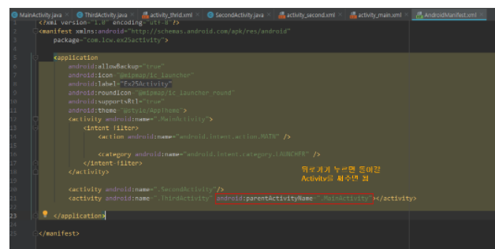
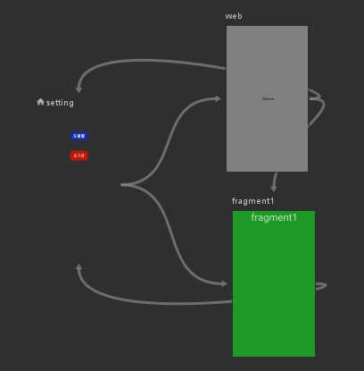

# day2_study

### **app bar 커스텀(==Action bar, Tool bar)**

1. manifest의 해당 Activity의 theme을 NoActionBar로 설정
2. 해당 Acitivity xml에 AppBar 위젯 넣고, 그 안에 MaterialToolBar 위젯넣는다
3. app bar이름은 title, 좌측버튼은 navigationIcon property로 설정가능

### **openURL**

Intent에 ACTION_VIEW 액션설정 + url담아서 startActivity하면된다

openURL사용하려면 manifest에 Internet permission허용해줘야하고

application태그안에  android:usesCleartextTraffic="true"해줘야한다

//http접근 허용하기위해 (안드로이드 Pie버전부터 http접근 막음)

```kotlin
var url = "[https://boostcamp.connect.or.k](https://boostcamp.connect.or.k/)r"
var intent = Intent(Intent.ACTION_VIEW,Uri.parse(url))
startActivity(intent)
```

**intent**

컴포넌트간의 작업수행을 위해 정보를 전달하는 메시지 객체

**ACTION_VIEW**

Intent의 주요 액티비티 액션으로 주로 url을 띄울때 사용한다

### **dialog**

```kotlin
var dialog = AlertDialog.Builder(requireContext())
dialog.setTitle("게임 초기화")
dialog.setMessage("텍스트")
var listener = DialogInterface.OnClickListener{_, p1->
when(p1){
        DialogInterface.BUTTON_NEGATIVE->{null}
        DialogInterface.BUTTON_POSITIVE->{
            Toast.makeText(activity,"초기화..", Toast.LENGTH_SHORT).show()
        }
    }
}
dialog.setNegativeButton("Cancel",listener)
dialog.setPositiveButton("Reset",listener)
dialog.show()
```

AlertDialogBuilder를 사용하면 되며 negativeButton과 positiveButton위치 주의!

dialog에서 버튼을 set할때 DialogInterface의 onClicklistener를 인자로 가진다

### **WebView**

```kotlin
var url = "https://boostcamp.connect.or.kr"
webView.apply{
webViewClient= WebViewClient()
settings.javaScriptEnabled= true
}
webView.loadUrl(url)
```

xml에 WebView를 추가해주고 소스코드에서 webView.apply로 사용하면된다.

settings.javaScriptEnabled= true 이거는자바스크립트를 허용한다는 말

### **화면전환**

**activity→activity**

Intent에 실행할 activity담아서 startActivity() or startActivityForResult()

startActivity = 새로운 액티비티 실행

startActivityForResult = 새로운 액티비티 실행 + 호출한 액티비티에서 결과 받을때

추가로 manifest에서 activity에 parent지정해주면 뒤돌어가기할 activity 지정할 수 있다. 이때는 부모에서 startActivity할때 finish()하면 안된다.




**activity → fragment** 

activity xml에서 FrameLayout위젯 추가한 다음에

activity 소스코드에서 

```kotlin
var transaction = supportFragmentManager.beginTransaction()
transaction.replace(R.id.frameLayout, fragment1())
transaction.commit()
```

이렇게해서 FrameLayout부분을 fragment로 대체(replace)한다

**fragment → fragment**

사실상 fragment에서 화면전환은 아니다

해당 host activity에서 전환시켜주는것. 따라서 activity→fragment와 같다

### **JetPack Navigation Graph**

- 안드로이드에서 스토리보드(화면 흐름 보여주는것) 구현가능 + 화면간 액션도 설정 가능
- fragment화면 전환을 드래그 방식으로 쉽게 구현할 수 있다

Navigation Graph은 직관적으로 fragment흐름을 보여주기위해 사용된다

1. framelayout이 필요없다. 

    ㄴ xml파일에서 fragment 띄우고 싶은 위치에 fragment위젯 추가해준다

    이때 name속성은 android:name="androidx.navigation.fragment.NavHostFragment"

    이거여야한다. 시작 fragment임을 알려주기위함

    app:defaultNavHost="true" 이것도 추가해줘야한다

    app:navGraph="@navigation/nav_graph"

2. res>navigation폴더 만들어서 root element navigation으로 해서 navigation_graph파일 만든다.
3. navigation_graph에서 원하는순서로 fragment 연결해주면 자동으로 코드도 만들어진다.
4. 그다음 동작해야하는 fragment 클릭이벤트에서

Navigation.findNavController(v).navigate(R.id.action_setting_to_web)

다음과 같이 작성해주면된다

ㄴ 이때 반드시 action_setting_to_web을 action으로 가지는 fragment에서 작성해줘야한다. 안그럼 에러

추가적으로 navigation을 쓰면 framelayout이 필요없는데 framelayout안에

fragment를 넣어주면 findViewById에서 fragment 못찾는다.




Navigation graph 장점

- 스토리보드를 한눈에 확인할 수 있다
- back stack을 자동으로 관리해준다
- id로 fragment간 이동 가능

단점

- 인스타그램 스타일 UX 어렵다 → back stack 여러개두는거

    ㄴ 알파버전에서는 가능하다고 한다

### **콜백함수**

콜백함수란 dough maker, coordinator, baker있을때 

coordinator → dough maker한테 dough준비되면 baker한테줘

이후 dough준비되면 doughmaker → baker한테 dough준다

이때 baker가 callback 함수.

즉 1이란 함수한테 2를 알려주면서 너 작업 다하면 or 이벤트발생하면 2한테 알려줘라고하고 자기 할일(비동기 프로그래밍)하는데 이때 2가 callback함수. 즉 다시 알려줄 함수라고 생각하면된다

[https://www.youtube.com/watch?v=-mir74x3f5Y](https://www.youtube.com/watch?v=-mir74x3f5Y)

따라서 안드로이드에서 버튼클릭리스너 동작방식을 보면

```kotlin
	Button button = (Button)findViewById(R.id.button);
	button.setOnClickListener(new View.OnClickListener() { 
	@Override public void onClick(View view) { 
	text.setText(edit.getText()); } 
	}
);
```

여기서 button에 setOnClickLister를 등록하려고한다(click event 감지하는 listener)

감지하고나면 onClick함수 동작하라고 onClick함수를 콜백함수로 넘겨준다.

따라서 click event감지하면 콜백함수 onClick 실행한다.

즉 안드로이드 프로그래밍에서 리스너 등록하는거나 startActivityForResult

등은 콜백패턴이라 할 수 있다.