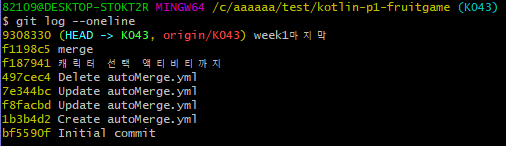
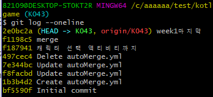
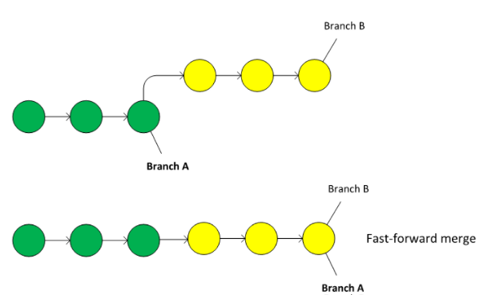
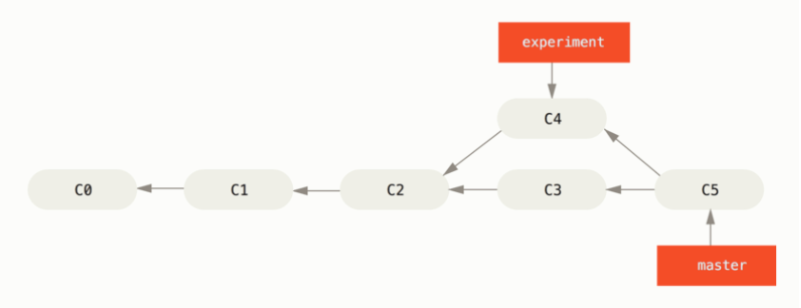
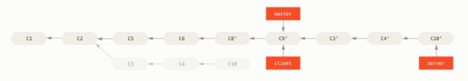

# git-fork, pull request, rebase

### **upstream, downstream**

- 상대적인 개념이다
- 윗물, 아랫물 개념처럼

작업을 진행할 레포지토리 - upstream

upstream을 fork해온 내 레포지토리 - downstream을 보면된다.

- downstream은 주로 origin이라고 부른다

### **작업순서**

1. upstream에서 내 저장소로 fork해온다 = 내 origin 생성

    ㄴ github에서 fork버튼으로 가능

2. 내 origin에서 내 local로 나한테 할당된 branch만 가져온다

모든 branch가져오는것은 불필요하므로 single branch옵션으로 가져온다

**git clone -b myMainBranch —single-branch origin주소(.git)**

이 myMainBranch가 내 local의 main branch다.

main branch는 주로 건드리지 않는다. 따로 branch따서 작업

1. local에서 새로운 branch생성 후 거기서 작업한다

**git checkout -b new_branch**

**git add .**

**git commit**

(git commit여러개하고 push하면 commit여러개한거 한번에 올라간다)

**git push origin new_branch**

(new_branch로 체크아웃 된 상태인데 git push origin myMainBranch하면 최신상태라고 뜰거다. myMainBranch는 작업 안했으므로.

따라서 작업한 branch를 push한다)

new_branch로 push하고나면 github에서 pull request 날릴 수 있다.

여기서 from : new_branch / to : 나한테 할당된 branch로 PR보내야한다

conflict없으면 merge된다

이후 작업을 시작하기전에 upstream의 내용과 내 local의 myMainBranch를 동기화시켜줘야한다.

이유1. 코드가 같다고 모든 PR이 merge되는것은 아니다

ㄴ 이전 upstream의 commit기록과 새롭게 PR한 commit 기록이 충돌되면 안된다

즉 upstream 커밋이력은 1→2→3인데 새롭게 3→4→5 PR보내면 3이 겹쳐서 충돌

(push하면 새롭게 추가된 커밋이력만 push된다. 따라서 해당 안되는듯?)

이유2. 이전에 merge한 커밋부터 이어서 작업한게 아니라면 변화를 추적하지 못한다.

rebase and merge하면 commit이력 새로 추가되지 않는다

(rebase하면 commit 해시값 변경된다!! 참고!!)

하지만 fetch and merge 하게되면 fork된 저장소의 기존커밋에 upstream의 커밋이 더해져 커밋내역이 원격과 달라져요! upstream의 커밋은 내용이 같아보여도 author는 같지만 committer가 마스터님으로 되어있는 다른 커밋입니다!

이렇다고한다. 확인해보면

위에가 내가 pull request한거

밑에가 pull request이후에 merge된거

따라서 최종 이력이 달라서 rebase and merge가 안된다(9308330 ≠2e0bc2a)

따라서

**git remote add upstream upstream주소 → upstream 주소 add.** 

**git fetch upstream 할당받은 branch  → 내 체크아웃된 branch로 할당받은 branch만 가져와라**

**git rebase upstream/할당받은 branch → 내 현재 branch와 upstream에서 할당받은 branch rebase and merge.**

여기까지하면 원격저장소와 내 local 동기화 완료.

이상태에서 다시 branch만들어서 작업하면된다

**git add, commit push ...**

git flow보면

주로 main branch는 작업하지않고 따로 branch만들어서 병합할때만 사용한다.

읽어보기!!

[https://danielkummer.github.io/git-flow-cheatsheet/](https://danielkummer.github.io/git-flow-cheatsheet/)

### **merge**

**fast forward방식**

새로운 commit을 생성하지 않는다

**3-way merge**

다음과 같이 새로운 commit이력이 생긴다.

**rebase**

rebase이전의 이력들이 다 그대로 추가된다.

master branch에 newbranch rebase방식으로 merge하고싶으면

checkout newbranch에서 git rebase master하면 newbranch의 base(parent)가 master의 가장 마지막 commit으로 바뀐다.

그다음 master로 checkout해서 git merge newbranch하면 fast forward방식으로 merge된다

즉

git checkout newbranch

git rebase master

git checkout master

git merge newbranch