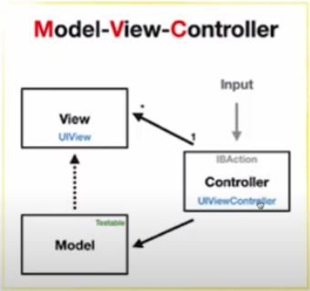
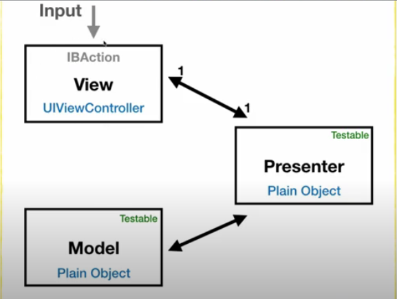
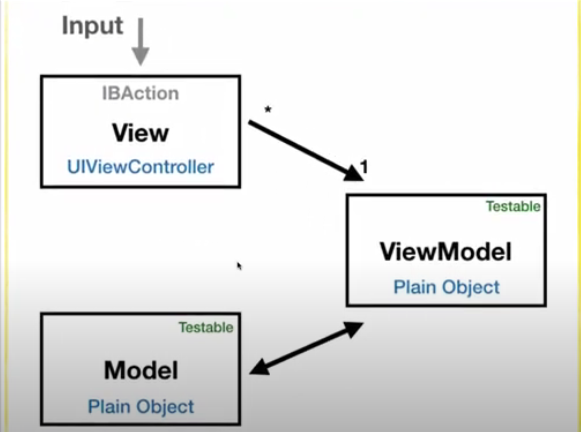

# sw아키텍쳐 패턴

SW설계하는 디자인 패턴

**비즈니스 로직** : 코딩을 수행하는데 있어서 전반적인 흐름

프로그램을 분할해서 설계해야 로직에 대한 테스트도 진행할 수 있다

**의존성이 낮다** : 한개가 변경되면 다른한개도 변경사항이 적다

### **MVC패턴**

**View : UI담당** ( Model을 observe하고 있어서 notification같은 이벤트가 발생하면 데이터를 변경가능하지만 Controller가 정해준 View만 활성화된다? 라고 생각하면 된다)

**Model : 데이터담당**(데이터 가지는 클래스라 생각)

**Controller : View와 Model사이에서 컨트롤** (UIViewController(input처리)가 여기에 위치)

ㄴ 사용자 input, 처리, 결과를 화면에 보여주는 것도 담당

View, Model이 너무 Controller의존적

**동작순서**

1. 사용자의 Action(input)이 Controller로 들어온다
2. Controller는 사용자의 action을 확인하고 Model 업데이터
3. Controller는 Model을 나타낼 View를 선ㅌ택
4. View는 Model을 이용하여 화면 업데이트(직접 확인 or notify event방식 or Polling방식으로 Model주기적으로 관찰)

### **MVP패턴**

**View : UI담당 (UIViewController가 여기에 위치)**

ㄴ 따라서 View에서 사용자 input 받아들임. 받아들인 input Presenter로 바로 전송

**Model : 데이터담당**

**Presenter : View로 들어온 input을 바탕으로 화면에 보여질 것을 정해준다**. 이렇게  정해진것을 VIew는 보여주기만 하면 된다

ㄴ UI랑 상관이 없으므로 Test(단위테스트) 가능

Presenter를 통해 View와 Model이 분리되었다. 즉 View는 Model을 따로 몰라도된다

but View와 Presenter의 의존성이 너무 강하다

view하나 만들떄마다 매번 Presenter만들어야한다(Presenter가 view에 보여질 내용 정해주므로). 중복 많이 발생 + 대부분 중복 로직으로 처리

**동작순서**

1. View를 통해 사용자의 Action입력
2. View는 Action Presenter로 전달 및 UI 데이터 요청
3. Presenter는 받은 Action바탕으로 Model로부터 데이터 요청, Model은 응답
4. Presenter는 받은 데이터 View로 응답
5. VIew는 받은 데이터 바탕으로 UI변경

### **MVVM패턴**

**ViewModel** : 화면에 보여질 데이터 요소만 가지고있겠다

ㄴ Model이랑만 처리한다

ㄴ View로부터 사용자 input전달되면 그에맞게 데이터변경.

**View** : 알아서 다 그린다

ㄴ ViewModel을 지켜보고있다가 데이터 변경되면 알아서 자동으로 변경

View가 여러개가 있더라도 비슷한 데이터를 다룬다면 같은 ViewModel을 공유가능

View와 ViewModel의 의존성을 분리가능하다(Command패턴때문에)

View : ViewModel은 다 : 1의 관계다

ViewModel의 설계가 쉽지않다.

**동작순서**

1. 사용자의 Action이 View를 통해 들어온다
2. View에 Action이 들어오면 Command패턴(기능 캡슐화한것)으로 View Model에 Action전달
3. View Model은 Model에게 데이터 요청, Model은 요청에 응답
4. View Model은 응답받은 데이터 가공해서 저장
5. View는 View Model과 Data binding하며 UI업데이트

**Command패턴**

- 실행할 기능을 캡슐화함으로써 기능을 실행하는 요청하는 호출자와 기능을 실행하는 수신자 사이의 의존성을 제거한다(실행될 기능이 변경되어도 호출자나, 수신자의 클래스 변경 불필요)