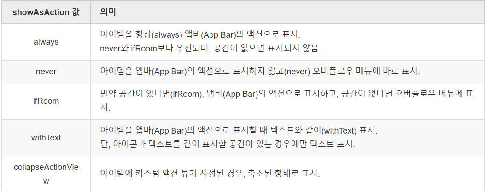

# week2

### **커스텀 ToolBar 및 새로고침 버튼**

기존에는 GameActivity에서 ToolBar를 만든다음에 새로고침을 누르면 기존에 띄워진 playGame fragment에서 refresh가 동작하도록 하려고했으나 잘 안되기도 하고, ToolBar의 중복이 많이없어서 playGame fragment 내부에 ToolBar를 추가해주었다

**수정 → activity에 toolbar 설정하고 setSupportActionBar해준뒤에 fragment에서 setHasOptionsMenu(true) 이거랑 버튼클릭 리스너 작성해주면 fragment에서 toolbar사용가능!**

커스텀 ToolBar 사용방법

1. AndroidManifest.xml파일에서 android:theme을 @style/Theme.Design.NoActionBar로 바꿔준다
2. 사용할 xml파일에 Toolbar view를 추가한다
3. Toolbar의 왼쪽 버튼을 만들고 싶다면 Toolbar의 navigationIcon속성 이용해서 이미지추가
4. 오른쪽에 버튼을 추가하기위해 menu xml 생성 (res>menu에 xml파일 생성)
5. menu.xml작성

ex) 새로고침 버튼만 필요하므로 item을 하나만 설정해주었다.

showAsAction속성으로 always를 넣어서 항상 toolbar에 표기되도록 하였다.

```
<menu xmlns:android="http://schemas.android.com/apk/res/android"
    xmlns:app="http://schemas.android.com/apk/res-auto">
    <item
        android:id="@+id/refresh_button"
        android:title="새로고침"
        android:icon="@android:drawable/ic_menu_revert"
        app:showAsAction="always"
        />
</menu>

toolbar_menu.xml
```




1. ActionBar에 해당 커스텀 toolBar 설정

ex)

```kotlin
(activityas AppCompatActivity).setSupportActionBar(binding.toolBar)  //
이게 toolbar를 해당 layout에 적용해주는 부분이다.

그다음에
setHasOptionsMenu(true)  //activity의 toolbar권한 가져오는 부분
이거를 해당 toolbar를 가져오고 싶은 layout 소스코드의 onCreate부분에 작성하면 해당 toolbar를 가져올 수 있다.
```

1. onCreateOptionsMenu(), onOptionsItemSelected() override

ex)

```
override fun onCreateOptionsMenu(menu: Menu, inflater: MenuInflater) {
    inflater.inflate(R.menu.toolbar_menu, menu)  //작성한 toolbar_menu inflate
}
override fun onOptionsItemSelected(item: MenuItem): Boolean {  //toolbar button listener
    if(item.itemId== R.id.refresh_button){
        updateView(); findWinner()
    }
    return super.onOptionsItemSelected(item)
}

위 내용을 버튼 클릭 이벤트를 발생시키고 싶은 layout소스코드에 작성하면된다
```

### **view binding 사용법**

1. app폴더의 build.gradle( 최상단 build.gradle말고)의 android 부분에 해당내용 추가

```kotlin
buildFeatures{
	viewBinding = true
}

app폴더의 build.gradle
```

1. 이후 사용할 소스코드에서 

binding = FragmentPlayGameBinding.inflate(inflater, container, false)이런식으로 작성하면

binding.리소스ID로 xml객체에 접근할 수 있다.

FragmentPlayGameBinding은 작성규칙 : activity,fragment종류 + 클래스이름 pascal case인듯

view binding을 사용해도 여전히 button같은거는 setOnClickListener따로 등록해줘야한다.

```kotlin
binding.radio2.setOnClickListener(this)
binding.radio3.setOnClickListener(this)
binding.radio4.setOnClickListener(this)
```

### **navigation graph의 popUpTo, popUpToInclusive에 대해**

주로 destination과 popUpTo는 같이사용하는데

destination은 해당 fragment로 이동

popUpTo는 fragment stack을 현재 popUpTo까지 pop시키고

popUpToInclusive는 현재 popUpTo fragment까지 pop시킬지를 true, false로 지정하는거다

```kotlin
<fragment
    android:id="@+id/setting"
    android:name="com.example.fruitcardgame.Setting"
    android:label="fragment_setting"
    tools:layout="@layout/fragment_setting" >
    <action
        android:id="@+id/action_setting_to_web"
        app:destination="@id/web"  //현재 setting -> web으로 이동
        app:popUpTo="@id/setting"  //setting까지 pop시키고
        app:popUpToInclusive="true" />  //현재 popUpTo까지 pop시킨다
    <action
        android:id="@+id/action_setting_to_playGame"
        app:destination="@id/playGame"  //현재 setting -> playGame이동
        app:popUpTo="@id/setting"  //setting이 맨위에 올 때 까지 pop시키고
        app:popUpToInclusive="true" /> //맨 위인 setting도 pop시킨다
```